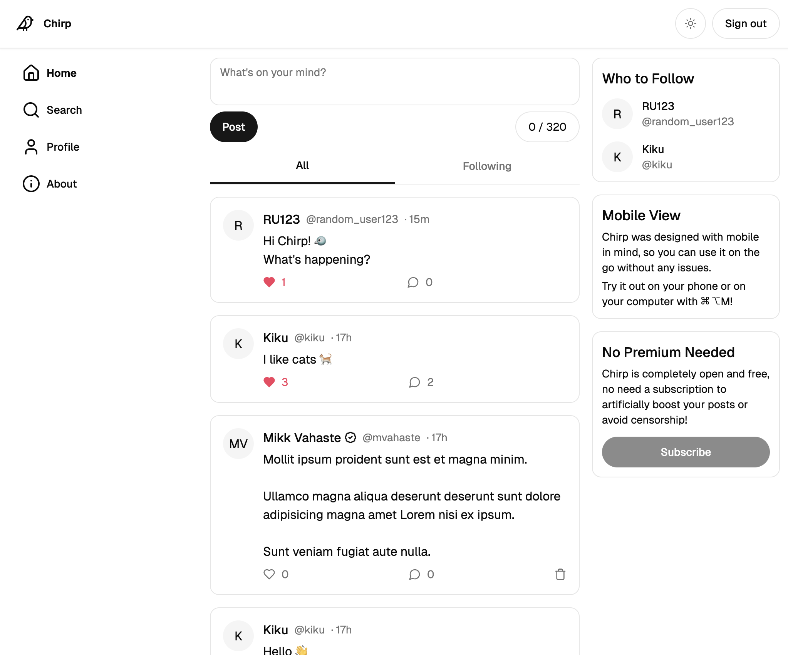
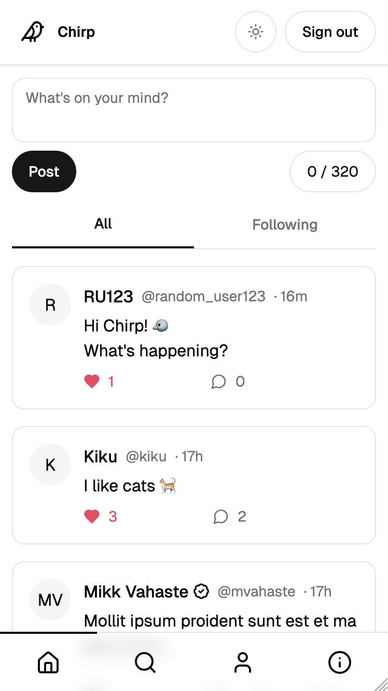
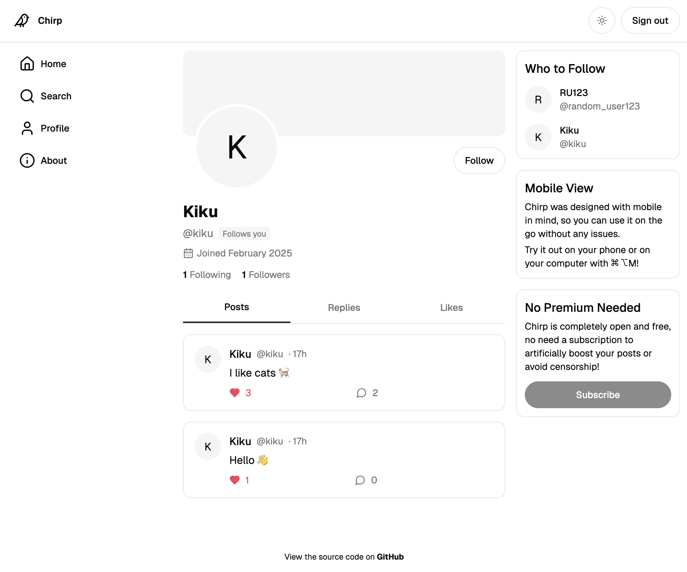
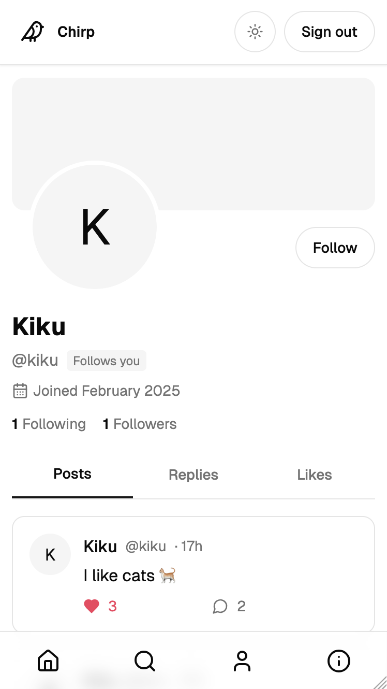

# 🐦 Chirp

_The best bird-themed social media platform._

## Table of Contents

1. [😮 What is it?](#😮-what-is-it?)
2. [🤔 Why make this?](#🤔-why-make-this?)
3. [⚙️ How was it made?](#⚙️-how-was-it-made?)
4. [🖼️ Screenshots](#🖼️-screenshots)
   1. [Home](#home)
   2. [Profile](#profile)

## 😮 What is it?

Chirp is a basic Twitter clone made with [Next.js 15](https://nextjs.org/) and [Supabase](https://supabase.com/).

Users can sign up and set a username, change their display name, bio, and create posts. They can also like other users' posts, reply to them or follow them.

## 🤔 Why make this?

I made this to check out and learn [Supabase](https://supabase.com/) and to remind myself how to use SQL.

I also wanted something that I could add to my resume, since most of my projects have to be private.

## ⚙️ How was it made?

Chirp was made with the following technologies:

- [Next.js 15](https://nextjs.org/) for the frontend framework
- [Supabase](https://supabase.com/) for the backend
- [shadcn/ui](https://ui.shadcn.com/) for base UI components
- [TailwindCSS](https://tailwindcss.com/) for CSS
- [Vercel](https://vercel.com/) for the hosting

## 🖼️ Screenshots

Screenshots taken from my account `@mvahaste`.

### Home

| Desktop                                               | Mobile                                              |
| ----------------------------------------------------- | --------------------------------------------------- |
|  |  |

### Profile

| Desktop                                                     | Mobile                                                    |
| ----------------------------------------------------------- | --------------------------------------------------------- |
|  |  |
